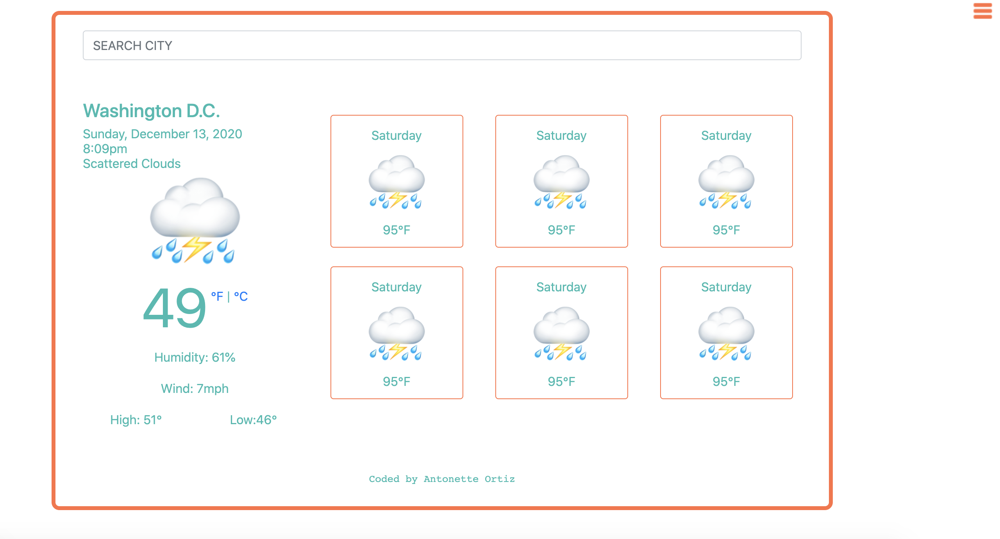

## Google Book API Modal Project
_____________

__Deployed Project__
https://antonetteortiz.github.io/weather-app/

__Sample__
***

__Project Description__
This project uses the open weather api to load the seven day forcast. When the user searches for a city, the forcast and location is updated to the city searched. All information is populated via the API. Hamburger menu to the right side with pre-loaded favorite cities. 

__Languages__
Languages used are html, css, and javascript.